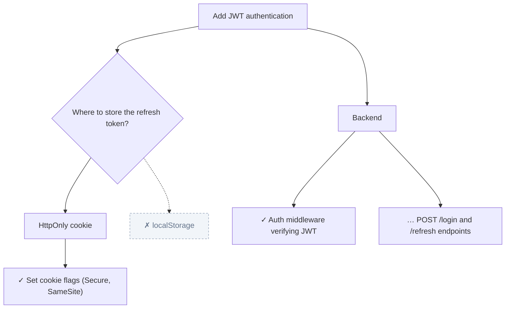

# cc-plan-tree 🌳

**Turn Claude Code's plan mode into a visual design tree** — see every design decision (including the options you *didn't* take), verify the finished code still matches the design, and embed the tree right in your pull request.

<!-- TODO: demo GIF here -->



## Why

Plan mode produces walls of text. The design decisions — *"we considered localStorage but chose HttpOnly cookies because of XSS"* — vanish the moment the session ends. cc-plan-tree keeps them:

- 🌳 **Plans become trees.** Phases, steps, and every clarifying question as a decision node with chosen/rejected options.
- 🔍 **Design ⇄ code verification.** Before your PR is ready, `/plan-verify` checks each step of the tree against the actual diff and reports what matches, diverges, or is missing.
- 📎 **Lives in your PR.** The tree is embedded in the PR body as Mermaid — GitHub renders it natively, reviewers see the design at a glance.
- 🖼️ **PNG export** for docs, Slack, and anywhere Mermaid doesn't render.

## Install

```bash
# with uv (recommended)
uv tool install cc-plan-tree
cc-plan-tree init            # installs the slash commands into ~/.claude/commands

# or with pip
pip install cc-plan-tree && cc-plan-tree init

# or zero-install, one shot
uvx cc-plan-tree init
```

Use `cc-plan-tree init --project` to install into the current project's `.claude/commands` instead.

From source:

```bash
git clone https://github.com/natsu0529/cc-plan-tree
cd cc-plan-tree && pip install -e . && cc-plan-tree init
```

## Workflow

Inside Claude Code:

| Command | What it does |
|---|---|
| `/plan-tree <task>` | Plans the task. Clarifying questions become **decision nodes** (rejected options stay visible, greyed out). The plan is saved to `.cc-plan-tree/plan.json` and shown as a Mermaid tree. Approve it and implementation starts; step statuses update as work completes. |
| `/plan-verify` | Diffs the branch against the design tree. Reports ✅ matches / ⚠️ diverges / ❌ missing per node. On divergence you choose: fix the code, or fix the tree. When consistent, it offers to embed the tree into the PR body via `gh` (with your confirmation). |
| `/plan-export [path]` | Renders the tree to PNG (default `./plan-tree.png`). No headless browser — pure Pillow. |

The CLI also works standalone:

```bash
cc-plan-tree render .cc-plan-tree/plan.json --format mermaid   # stdout
cc-plan-tree render --format svg --out design.svg
cc-plan-tree render --format png --out design.png
```

## Plan file format

`.cc-plan-tree/plan.json` is a nested tree of nodes:

| type | meaning |
|---|---|
| `goal` | The root: what is being built |
| `phase` | A group of steps |
| `step` | Concrete work item, carries `status`: `pending` / `in_progress` / `done` |
| `decision` | A design question that was asked |
| `option` | An answer to a decision; `chosen: true/false`, rejected ones keep a `reason` |
| `note` | Free-form annotation |

See [examples/sample-plan.json](examples/sample-plan.json) for a full example.

## Roadmap

- [ ] Adapters for other coding agents (Codex CLI, Gemini CLI) via the shared plan format
- [ ] Plan version diffing (what changed between plan v1 and what shipped)
- [ ] Interactive HTML view

Contributions welcome — the plan format is intentionally agent-agnostic, so adapters are a great first PR.

## License

MIT
